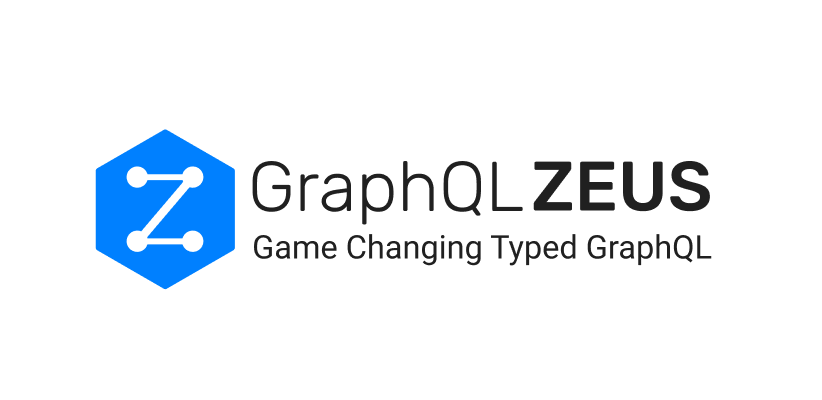
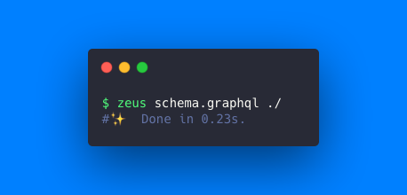
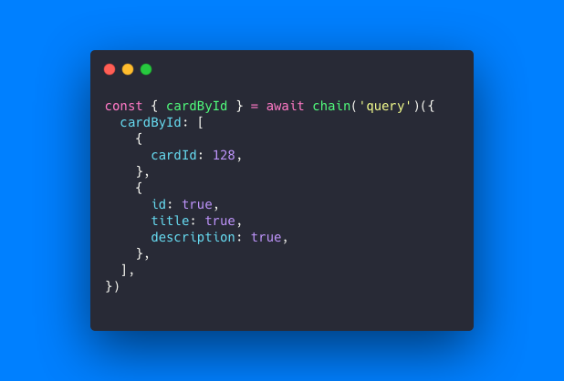

[](https://www.npmjs.com/package/graphql-zeus) [](http://commitizen.github.io/cz-cli/) [](https://www.npmjs.com/package/graphql-zeus)

Strongly Typed GraphQL from the team at [GraphQL Editor](https://graphqleditor.com/?utm_source=graphql_zeus_github)

GraphQL Zeus is the absolute best way to interact with your GraphQL endpoints in a type-safe way. Zeus uses your schema to generate Typescript types and strongly typed clients to unlock the power, efficiency, productivity and safety of Typescript on your GraphQL requests.

## Features

⚡️ Types mapped from your schema <br/>
⚡️ Works with Apollo Client, React Query, Stucco Subscriptions _(*more coming soon...)_<br/>
⚡️ Works with Subscriptions <br/>
⚡️ Infer complex response types <br/>
⚡️ Create reusable selection sets (like fragments) for use across multiple queries <br/>
⚡️ Supports GraphQL Unions, Interfaces, Aliases and Variables<br/>
⚡️ Handles **massive** schemas <br/>
⚡️ Supports Browsers, Node.js and React Native in Javascript and Typescript <br/>
⚡️ Schema downloader <br/>
⚡️ JSON schema generation <br/>

## Generate Types With Zeus CLI Example
Simply run Zeus in your terminal to output your types file based on your graphql schema



## Usage Example
Example using a generated `chain` client. Queries, mutations and subscriptions are now type-safe in arguments, field selections and response types.



## Zeus CLI

Use the Zeus CLI to generate types and GraphQL clients based on your schema which you can then import into your projects to autocomplete, query and use GraphQL responses in a type-safe way.

## Quick Start

### Installation
```sh
$ npm i -g graphql-zeus 
# OR 
# yarn global add graphql-zeus
```
You can also install locally to a project and then use as a npm or yarn script command or with `npx` or `yarn` directly eg:
```sh
$ npx zeus schema.graphql ./
# OR 
# yarn zeus schema.graphql ./
```

### TypeScript

Zeus is Typescript native, you can refer to imported types directly from the generated output of the CLI

```sh
$ zeus schema.graphql ./
```


### JavaScript

To use with Javascript as an autocomplete tool you need to install Typescript, run the Zeus CLI, and then transform the result to JS using `tsc`

```sh
$ npm i -D typescript
# OR
# yarn add -D typescript
```

Generate Zeus:

```sh
$ zeus schema.graphql ./
```

And transform it using Typescript:

```sh
$ npx tsc ./zeus/*.ts --declaration --target es5 --skipLibCheck
# OR
# yarn tsc ./zeus/*.ts --declaration --target es5 --skipLibCheck
```

This will generate an `out.d.ts` file so that you can have autocompletion.


#### Return with .js import for esModules

Due to validity of `.js` imports in TS for esmodules you can use flag `es` to generate `.js` imports

```sh
$ zeus schema.graphql ./ --es
```

## Demo Endpoint
All demo code here is using the demo GraphQL endpoint of [Olympus Cards](https://app.graphqleditor.com/a-team/olympus) built with [GraphQL Editor](https://graphqleditor.com/). Feel free to check out the [GraphiQL interface](https://faker.graphqleditor.com/a-team/olympus/graphql) too.

## Query With Zeus Chain Client
You can now use the Zeus `Chain` client from the generated output to make type-safe queries and mutations to your endpoint and receive type-safe responses.

```ts
import { Chain } from './zeus';
	
// Create a Chain client instance with the endpoint
const chain = Chain('https://faker.graphqleditor.com/a-team/olympus/graphql');

// Query the endpoint with Typescript autocomplete for arguments and response fields
const listCardsAndDraw = await chain("query")({
  cardById: [
    {
      cardId: 'da21ce0a-40a0-43ba-85c2-6eec2bf1ae21'
    },
    {
      name: true,
      description: true
    }
  ],
  listCards: {
    name: true,
    skills: true,
    attack: [
      { cardID: ['66c1af53-7d5e-4d89-94b5-1ebf593508f6', 'fc0e5757-4d8a-4f6a-a23b-356ce167f873'] },
      {
        name: true
      }
    ]
  },
  drawCard: {
    name: true,
    skills: true,
    Attack: true
  }
});
// listCardsAndDraw is now typed as the response of the query.
``` 

When querying a GraphQL field which takes an argument such as `cardById` above, then the fields are defined in terms of a tuple eg: cardById: `[ {...arguments} , {...response_selection_set} ]` the equivalent in gql syntax would be:
```text
cardById (cardId: "da21ce0a-40a0-43ba-85c2-6eec2bf1ae21") {
  name
  description
}
```

For fields which have no argument they receive only the response selection set object values.

Note: `Chain` will also accept a second argument of fetch-like options to configure the client with properties such as `credentials`, `mode`, `headers` etc...

Note: There is also an exported Zeus `Gql` convenience function is a Chain client pre-configured with the endpoint specified in the CLI.

## Listen on a WebSocket - GraphQL Subscriptions

Use the Zeus `Subscription` client creator in your generated output to create WebSocket connections to your GraphQL socket.

```ts
import { Subscription } from './zeus';

// Create a Subscription client instance with the endpoint
const sub = Subscription('https://faker.graphqleditor.com/a-team/olympus/graphql');

// Call the client instance and listen for responses
sub('subscription')({
  deck: {
    id: true,
  },
}).on((response) => {
  console.log(response.deck);
});
```

## Perform Queries with Thunder - An Abstracted Fetch Function

With Zeus `Thunder` you have total control of fetch function but will not lose the result type. ⚡️

```js
import { Thunder } from './zeus';
	
// Create thunder fetch client with endpoint, options and response handlers
const thunder = Thunder(async (query) => {
  const response = await fetch('https://faker.graphqleditor.com/a-team/olympus/graphql', {
    body: JSON.stringify({ query }),
    method: 'POST',
    headers: {
      'Content-Type': 'application/json',
    },
  });
  
  if (!response.ok) {
    return new Promise((resolve, reject) => {
      response
        .text()
        .then((text) => {
          try {
            reject(JSON.parse(text));
          } catch (err) {
            reject(text);
          }
        })
        .catch(reject);
    });
  }
  
  const json = await response.json();
  
  return json.data;
});

// Call thunder client with type-safe arguments, fields and get type-safe result type
const listCardsAndDraw = await thunder('query')({
  cardById: [
    {
      cardId: 'sdsd',
    },
    {
      description: true,
    },
  ],
  listCards: {
    name: true,
    skills: true,
    attack: [
      { cardID: ['s', 'sd'] },
      {
        name: true,
      },
    ],
  },
  drawCard: {
    name: true,
    skills: true,
    Attack: true,
  },
});
```

## Usage with Apollo GraphQL

Zeus can generate type-safe versions of Apollo Client's `useQuery`, `useMutation`, `useSubscription` and `useLazyQuery` React hooks as `useTypedQuery`, `useTypedMutation` etc... by adding the `--apollo` flag to the CLI. All types in the `data` response are then inherited from the Zeus query. 🚀

### Generate Type-Safe Zeus Schema And Apollo Client Type-Safe Hooks
```sh
$ zeus schema.graphql ./  --apollo
# apollo.ts file with typed hooks is now in the output destination
```

### Apollo Client `useTypedQuery` Hook Example
```tsx
import { useTypedQuery } from './zeus/apollo';

const Main = () => {
  const { data } = useTypedQuery({
    // Get autocomplete here:
    drawCard: {
      name: true,
    },
  });
  // data response is now typed
  return <div>{data.drawCard.name}</div>;
};
```

### Inferring the response type for Apollo Client

If you would like to infer the response type of your query for Apollo Client you can use the Zeus `Selector` function and `InputType` utility from the Zeus generated library

```tsx
import { Selector, InputType, GraphQLTypes } from './zeus';

export const drawCardQuery = Selector("Card")({
  drawCard: {
    id: true,
    name: true,
    Attack: true,
    Children: true,
  },
});

type DrawCardResponseType = InputType<GraphQLTypes['Card'], typeof drawCardQuery>;
// DrawCardResponseType is now the response type from the query
```

Now `drawCardQuery` can be reused directly in the typed Apollo Client `useTypedQuery` later

```tsx
import { useTypedQuery } from './zeus/apollo';
import { drawCardQuery } from './';

const Main = () => {
  const { data } = useTypedQuery(drawCardQuery);
  // data is of type DrawCardResponseType as per the above example
  return <div>{data.drawCard.name}</div>;
};
```

## Usage with React Query

Zeus can generate type-safe versions of React Query's `useQuery`, `useMutation` etc.. React hooks as `useTypedQuery`, `useTypedMutation` etc... by adding the `--reactQuery` flag to the CLI. All types `data` response are then inherited from the Zeus query. 🚀

```sh
$ zeus schema.graphql ./  --reactQuery
```

```tsx
import { useTypedQuery } from './zeus/reactQuery';

const Main = () => {
  const { data } = useTypedQuery({
    // Get autocomplete here:
    drawCard: {
      name: true,
    },
  });
  // data response is now typed
  return <div>{data.drawCard.name}</div>;
};
```

## Usage with Stucco Subscriptions

Zeus can generate types for the Stucco Subscription library by adding the --stuccoSubscriptions flag to the CLI. All types in `data` are then inherited from the Zeus Query

```sh
$ zeus schema.graphql ./  --stuccoSubscriptions
```

```typescript
stuccoSubscriptions((apiFetchResult) => [apiFetchResult.url], 'https://my.backend/graphql')({ drawCard: { Attack: true } }).on((args) => args.drawCard.Attack);
```

## Usage with NodeJS

Generates clients for use with Node.js

```sh
$ zeus schema.graphql ./  --node
```

## Usage with React Native

As normal
```sh
$ zeus schema.graphql ./
```

## Other CLI Options
Specify the output folder with second argument
```sh
$ zeus schema.graphql ./generated
```

Output Typescript Only with `--typescript` flag
```sh
$ zeus schema.graphql ./ --typescript
```

Load your schema from an URL with an URL in the first argument
```sh
$ zeus https://faker.graphqleditor.com/a-team/olympus/graphql ./
```

Download and save GraphQL schema to a local path with `--graphql=savePath` flag
```sh
$ zeus https://faker.graphqleditor.com/a-team/olympus/graphql ./ --graphql=generated
```

Generate and save a JSON schema to a local path with `--jsonSchema=savePath` flag
```sh
$ zeus https://faker.graphqleditor.com/a-team/olympus/graphql ./ --graphql=generated
```

Add a header value with `--header=value` flag
```sh
$ zeus https://faker.graphqleditor.com/a-team/olympus/graphql ./ --header=Authorization:myNiceAuthHeader
```

Get help with Zeus CLI with:
```sh
$ zeus help
```

### Tip:
Add a script entry in your `package.json` file for quickly calling Zeus generation:
```json
"scripts": {
//...
"generate": "zeus https://faker.graphqleditor.com/a-team/olympus/graphql zeusGenerated --typescript --header='My-Auth-Secret:JsercjjJY5MmghtHww6UF' --apollo"
},
```

# More Powerful Features ⚡️⚡️⚡️⚡️
## GraphQL Variables

It's simple to perform queries with variables by importing and using the `$` function from the Zeus output and calling it with the variable name in backticks.

```ts
import { Gql, $ } from './zeus';

const addCardResult = await Gql('mutation')(
  {
    addCard: [
      {
        card: $`card`,
      },
      {
        id: true,
        description: true,
        name: true,
        Attack: true,
        skills: true,
        Children: true,
        Defense: true,
        cardImage: {
          bucket: true,
          region: true,
          key: true,
        },
      },
    ],
  },
  {
    variables: {
      card: {
        Attack: 2,
        Defense: 3,
        description: 'Lord of the mountains',
        name: 'Golrog',
      },
    }
  },
);
```
Note: The mutation function created by the Zeus versions of React Hooks like the Apollo Client version of `useTypedMutation` can be supplied with variable values at invocation eg:

```typescript
const [addCard, {data, loading, error}] = useTypedMutation({...myMutation})

await addCard({variables: {
  card: {
    Attack: 2,
    Defense: 3,
    description: 'Lord of the mountains',
    name: 'Golrog',
  }
}})
```

## GraphQL Unions

You can use Zeus with [GraphQL Unions](https://spec.graphql.org/June2018/#sec-Unions):

```js
const { drawChangeCard } = await chain('query')({
  drawChangeCard: {
    __typename: true,
    '...on EffectCard': {
      effectSize: true,
      name: true,
    },
    '...on SpecialCard': {
      effect: true,
      name: true,
    },
  },
});
```
Response:
```json
{
  "effectSize": 195.99532210956377,
  "name": "Destinee",
  "__typename": "EffectCard"
}
```

## GraphQL Interfaces

Zeus works with [GraphQL Interfaces](http://spec.graphql.org/June2018/#sec-Interfaces)

```ts
const { nameables } = await Gql('query')({
  nameables: {
    __typename: true,
    name: true,
    '...on CardStack': {
      cards: {
        Defense: true,
      },
    },
    '...on Card': {
      Attack: true,
    },
  },
});
```
Response:
```json
{
  "nameables": [
    {
      "__typename": "EffectCard",
      "name": "Hector"
    },
    {
      "__typename": "CardStack",
      "name": "Scotty",
      "cards": [
        {
          "Defense": 1950
        },
        {
          "Defense": 76566
        }
      ]
    },
    {
      "__typename": "SpecialCard",
      "name": "Itzel"
    }
  ]
}
```

## GraphQL Aliases

Zeus supports declaring aliases 🥸

```ts
const aliasedQueryExecute = await chain("query")({
  listCards: {
    __alias: {
      atak: {
        attack: [
          { cardID: ['1'] },
          {
            name: true,
            description: true,
          },
        ],
      },
    },
  },
});
```
Response:
```json
{
  "listCards": [
    {
      "atak": {
        "attack": [
          {
            "name": "Zelma",
            "description": "Central"
          }
        ]
      }
    }
  ]
}
```

Now you can access properties type-safe like this

```javascript
aliasedQueryExecute.listCards.map((c) => c.atak.attack);
```


## Generate GraphQL Gql Strings

Use the `Zeus` function to generate a gql string

```js
import { Zeus } from './zeus';

const stringGql = Zeus('query', {
  listCards: {
    name: true,
    skills: true,
    Attack: true,
  },
})

// stringGql value:
// query{listCards{name skills Attack}}
```

## Generate Reusable Selection Sets

In TypeScript Zeus can help make type-safe Zeus selection sets to reuse across queries.

```ts
import { Selector, Chain } from './zeus';

const chain = Chain('https://faker.graphqleditor.com/a-team/olympus/graphql');

const cardSelector = Selector('Card')({
  name: true,
  description: true,
  Attack: true,
  skills: true,
  Defense: true,
  cardImage: {
    key: true,
    bucket: true,
  },
});

const queryWithSelectionSet = await chain('query')({
  drawCard: cardSelector,
});
```

## Infer Response Types of Hooks with ZeusHook

Assuming that you created hook-like function

```ts
import { Gql, ZeusHook } from './zeus';

export const useZeus = () => {
  const drawACard = () => {
    return Gql('query')({
      drawCard: {
        name: true,
        Attack: true,
        Defense: true,
        Children: true,
        description: true,
      },
    });
  };
  return { drawACard };
};

type DrawCardResponse = ZeusHook<typeof useZeus, 'drawACard'>;
```


## Generate Code

This will be rarely used, but here you are! Generate Typescript and Javascript from GraphQL definitions

```js
import { TreeToTS } from 'graphql-zeus';
import { Parser } from 'graphql-js-tree';

const schemaFileContents = `
type Query{
    hello: String!
}
schema{
    query: Query
}
`;

const typeScriptDefinition = TreeToTS.resolveTree(Parser.parse(schemaFileContents));

const jsDefinition = TreeToTS.javascript(Parser.parse(schemaFileContents));
```

## Dynamically Fetch Schema

This is useful when you need your schema fetched from your GraphQL endpoint in-code

```js
import { Utils } from 'graphql-zeus';

Utils.getFromUrl('https://faker.graphqleditor.com/a-team/olympus/graphql').then((schemaContent) => {
  // Use schema content here
});
```

## Zeus Included Examples

To run the included examples navigate to: `./examples` and install packages with:

```sh
$ npm i
# OR
# yarn 
```

then run the examples with

```sh
$ npm run start
# OR
# yarn start
```

Use `Api` for single queries mutations and `Chain` for query chaining

## Zeus Spec
Promise of type query data object is returned.

```
PROMISE_RETURNING_OBJECT = Chain.[OPERATION_NAME]({
    ...FUNCTION_FIELD_PARAMS
})(
    ...QUERY_OBJECT
).then ( RESPONSE_OBJECT => RESPONSE_OBJECT[OPERATION_FIELD] )
```

Simple function params object

```
FUNCTION_FIELD_PARAMS = {
  KEY: VALUE
}
```

Query object

```
QUERY_OBJECT = {
    ...RETURN_PARAMS
}
```

Return params is an object containing RETURN_KEY - true if it is a `scalar`, RETURN_PARAMS if `type` otherwise it is a function where you pass field params and type return params.

```
RETURN_PARAMS = {
    RETURN_KEY: true,
    RETURN_KEY: {
        ...RETURN_PARAMS
    },
    RETURN_FUNCTION_KEY:[
        {
            ...FUNCTION_FIELD_PARAMS
        },
        {
            ...RETURN_PARAMS
        }
    ]
}
```

### Use Alias Spec

```
RETURN_PARAMS = {
  __alias: RETURN_PARAMS
}
```

Access aliased operation type-safe

```
PROMISE_RETURNING_OBJECT[ALIAS_STRING][OPERATION_NAME]
```

## Support And Community

[Join our GraphQL Editor Channel on Slack!](https://join.slack.com/t/graphqleditor/shared_invite/enQtNDkwOTgyOTM5OTc1LWI4YjU3N2U5NGVkNzQ2NzY5MGUxMTJiNjFlZDM1Zjc2OWRmNTI0NDM3OWUxYTk4Yjk3MzZlY2QwOWUzZmM2NDI)

Leave a GitHub star ⭐️ 😊

Spread the word!

## Contribute

For a complete guide to contributing to GraphQL Editor, see the [Contribution Guide](CONTRIBUTING.md).

1.  Fork this repo
2.  Create your feature branch: git checkout -b feature-name
3.  Commit your changes: git commit -am 'Add some feature'
4.  Push to the branch: git push origin my-new-feature
5.  Submit a pull request


## License

MIT 🕊